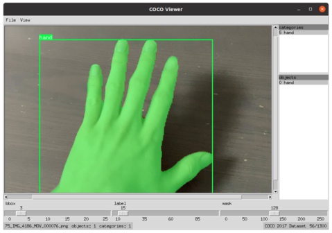

# Ozeu
Ozeu is the toolkit to generate labaled dataset for instance segmentation.
You can generate datasets labaled with segmentation mask and bounding box from the recorded video files.



## Installation
### Requirements
* ffmpeg
* torch
* mmcv-full

### Example installation command for cuda11.1.
```
pip install torch==1.8.1+cu111 torchvision==0.9.1+cu111 torchaudio==0.8.1 -f https://download.pytorch.org/whl/torch_stable.html

pip install mmcv-full==1.3.5 -f https://download.openmmlab.com/mmcv/dist/cu102/torch1.8.0/index.html

cd ozeu
pip install -e . 
```

## Usage
### 1. Record Video
I recommend record video with the camera where you want to run detector.
For webcam, you can use command like this.

```shell
ffmpeg -f v4l2 -framerate 60 -video_size 1280x720 -i /dev/video0 output_file.mkv
```

I recommend to place the object to record in a desk or somewhere on simple texture. That will reduce error rate. You can hold the object by your hand, because the dataset generator can recognize and remove hand like this.


### 2. Create dataset definition file.
You can write dataset definition file in yaml.
Please define class names and ids at `categories`, and please associate class id and video paths in the `datasets`. The class ids will be the label of the files. `video_path` is relative to the dataset definition file. Video files that are supported by ffmpeg can be used.

```yaml
categories:
  - id: 1
    name: alchol sheet
  - id: 2
    name: ipad
datasets:
  - category_id: 2
    video_path: IMG_4194_2.MOV
  - category_id: 2
    video_path: IMG_4195_2.MOV
```

### 3. Generate labaled coco dataset.
You can generate labaled coco dataset by giving the dataset definition file above. If you didn't hold object by hand while recording video, you can remove `--remove-hand` option.

```shell
python scripts/create_coco_dataset_from_videos.py  --dataset-definition-file ${DATASET_DEFINITION_FILE} --model-name u2net --output-path ${OUTPUT_DATASET_FOLDER} --resize-factor 2 --fps 15 --remove-hand
```

### 4. Generate background augmented datasets.
Please place background images at `backgrounds_for_augmentation`. The background augmentation script will use these files to replace background of datasets.
Here we use VOC images as background images

```shell
wget https://pjreddie.com/media/files/VOCtrainval_11-May-2012.tar
--2021-06-02 22:13:22--  https://pjreddie.com/media/files/VOCtrainval_11-May-2012.tar
tar xf VOCtrainval_11-May-2012.tar
mkdir backgrounds_for_augmentation
mv VOCdevkit/VOC2012/JPEGImages/* backgrounds_for_augmentation/
```

After preparing background images, please generate background augmented dataset by running

```shell
python scripts/generate_background_augmented_dataset.py --input-dataset-path ${DATASET_FOLDER} --destination-root ${AUGMENTED_DATASET_FOLDER} --augmentation-mode different_background
```

### 5. Merge 
You can merge background augmented dataset and dataset.

### 7. (Optional) Import dataset into cvat.
There is the annotation tool [CVAT](https://github.com/openvinotoolkit/cvat) that can accept coco format dataset.
So you can import dataset into your project and fix dataset.

### 6. TRAIN!
TRAIN!!!

## Acknowledgement
* I wish to thank my wife, Remilia Scarlet.
